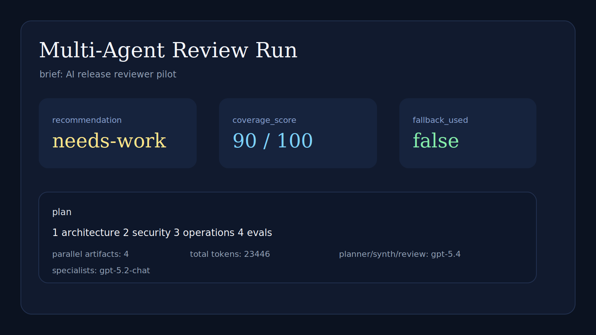
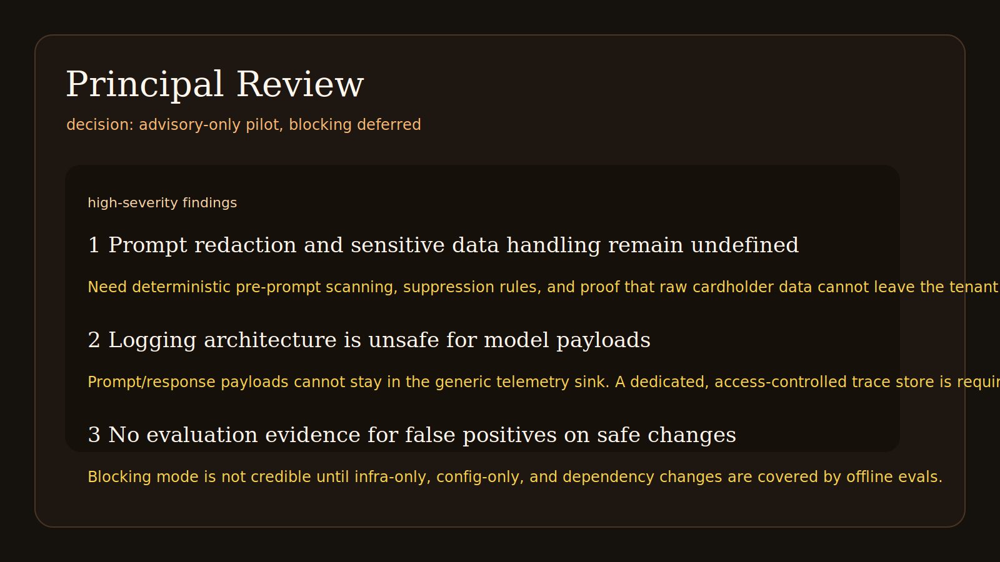

# multi-agent-orchestrator

Most multi-agent demos are group chats with unclear ownership and no durable outputs.

This repo is a narrower pattern: a technical review board with a fixed execution graph.

- planner writes the review plan
- specialists run in parallel against the same brief
- synthesizer writes the decision memo
- reviewer grades coverage and unresolved risk

The useful part is not “many agents.” It is the explicit artifact chain.

## What Runs Here

- Azure-backed planner on `gpt-5.4`
- parallel specialist passes on `gpt-5.2-chat`
- final synthesis and review on `gpt-5.4`
- local fallback plan when planner output is invalid
- checked-in execution artifacts from a live run

This is not a swarm framework. It is a concrete orchestrator for review workflows where architecture, security, operations, and evals need distinct output.

## Live Demo

The checked-in run evaluates an internal brief for an **AI release reviewer** that would inspect pull requests before production deployment.

Input:

- `demo/input/release-review-brief.md`

Generated artifacts:

- `demo/output/execution-plan.json`
- `demo/output/01-step-1.md`
- `demo/output/02-step-2.md`
- `demo/output/03-step-3.md`
- `demo/output/04-step-4.md`
- `demo/output/decision-memo.md`
- `demo/output/review.json`
- `demo/output/run-summary.json`

Rendered captures:




Observed summary:

```json
{
  "fallback_used": false,
  "steps": 4,
  "artifacts": 4,
  "total_tokens": 23446,
  "recommendation": "needs-work",
  "coverage_score": 90
}
```

Plan shape from `demo/output/execution-plan.json`:

```json
{
  "steps": [
    {"assigned_agent": "architecture", "title": "Define pilot architecture and control points"},
    {"assigned_agent": "security", "title": "Set mandatory security gates for pilot handling of release data"},
    {"assigned_agent": "operations", "title": "Validate production readiness and pilot operating model"},
    {"assigned_agent": "evals", "title": "Establish evidence threshold and approval recommendation"}
  ]
}
```

Decision excerpt from `demo/output/decision-memo.md`:

```md
**Approve a four-week pilot in advisory-only mode. Do not approve enforced blocking of production changes yet.**
```

Review excerpt from `demo/output/review.json`:

```json
{
  "release_recommendation": "needs-work",
  "findings": [
    {
      "severity": "high",
      "title": "Prompt redaction and sensitive data handling remain undefined"
    }
  ]
}
```

## Python API

```python
from pathlib import Path

from multi_agent_orchestrator import Orchestrator, Settings

brief = Path("demo/input/release-review-brief.md").read_text()
orchestrator = Orchestrator(settings=Settings.from_env())

run = orchestrator.run(
    goal=(
        "Decide whether the platform team should approve a pilot rollout "
        "of the AI release reviewer and define the controls required first."
    ),
    brief_title="release review brief",
    brief_markdown=brief,
)

print(run.review.release_recommendation)
print(run.final_memo_markdown)
```

## Run It

Install:

```bash
uv sync --extra dev
```

Set Azure variables:

```bash
export AZURE_OPENAI_ENDPOINT="https://<resource>.openai.azure.com/"
export AZURE_OPENAI_API_KEY="<key>"
export AZURE_OPENAI_API_VERSION="2025-04-01-preview"
export MULTI_AGENT_PLANNER_DEPLOYMENT="gpt-5.4"
export MULTI_AGENT_SPECIALIST_DEPLOYMENT="gpt-5.2-chat"
export MULTI_AGENT_SYNTHESIZER_DEPLOYMENT="gpt-5.4"
export MULTI_AGENT_REVIEWER_DEPLOYMENT="gpt-5.4"
```

Run the checked-in scenario:

```bash
uv run python scripts/run_live_demo.py
```

Or run the CLI against another brief:

```bash
uv run mao-run \
  --brief-file demo/input/release-review-brief.md \
  --goal "Review the launch plan and decide if pilot approval is justified." \
  --out-dir /tmp/multi-agent-review
```

## Design Constraints

- allowed specialist roles are code-defined
- planner output is validated before execution
- invalid plans fall back to a deterministic template
- specialist stages are parallel, but artifact order stays tied to the plan
- final review is structured and machine-readable

There is no hidden agent bus here. The coordination graph is small on purpose.

## Files Worth Reading

- `src/multi_agent_orchestrator/orchestrator.py`
- `src/multi_agent_orchestrator/client.py`
- `src/multi_agent_orchestrator/prompts.py`
- `scripts/run_live_demo.py`
- `docs/architecture.md`
- `docs/azure-foundry.md`

## Verify

```bash
uv run pytest -q
uv run python -m compileall src scripts
```
